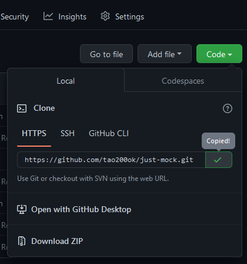

# How to contribute
Thanks for contributing. We need your skills.
## Make a copy
The first thing to do is create a personal copy of the project in your GitHub account by forking this repository. Click on the button as shown below.

Make sure to only fork the dev branch. Confirm that this box is checked when creating your fork.

## Set up the project on your machine
 Now that you have your own copy of the repository, the next step is to clone it to your machine. Click the button as shown below to copy your repository’s link.
 

Go to your terminal and run:

	git clone [link you copied]

Example:

	git clone https://github.com/octocat/just-mock

Since there will be several work by other developers going on at the same time, your local copy should be updated frequently. To set that up, run this command to connect your local copy to the original repository:

		git remote add upstream https://github.com/tao200ok/just-mock.git
 

>NOTE: Nodejs and npm are required to continue following this guide.
>
>Run `node -v` and `npm -v ` to verify that you have them installed.
>
>If you do, their currently installed versions will be displayed. Example: `v16.16.0` and `8.11.0`
>If not, follow [this tutorial](https://css-tricks.com/how-to-install-npm-node-nvm/#installing-node-version-manager) to quickly install them. 

 

To complete your set up,  use these commands to navigate to the project directory and install its dependencies:

		cd just-mock
		npm install

Start the local development server:

        npm start

Finally, open your browser and visit [http://localhost:3000](http://localhost:3000) to explore the app.

## Make your contribution.

### Pick an issue.
Head to the [issues page](./issues) and find an issue you want to work on. You can also create new issues and work on them.
### Create a branch. 
Before making changes to the codebase, you should first create a new branch for your work. The name of your branch should be related to the work you’re about to do.

Recommended format:
- feat/new feature: For a new feature addition.
- fix/bug to fix: For bug fixes.
- style/component to style: For style related branches,

For example, in the project directory, run

	git checkout -b feat/login page

to create and switch to a new branch to work on adding a new, login page.

Great! Now you can start making and committing changes on the new branch.

### Make your commits
It is good practice to make regular commits as you work on your feature.

		git commit -m "message"

Commit messages should be concise and follow a format similar to the above:
For example,

		git commit -m "feat: add validation to login form"
to commit changes made to add a new feature in the login form.

Tip: Update your local copy at intervals to keep in sync with the original repository.

		git pull upstream
		
## Submit your contribution
To get your contribution merged to the original repository, create and submit a pull request. After pushing your changes to your Github, follow the steps below.

- Open to your copy of the repository on GitHub and you'll see a button “Compare & pull request” and click it.
- Give your pull request a descriptive but brief title.
- Describe the changes you've made, include necessary details and where necessary, attach image(s) describing changes you've made.
-  Where applicable, link related issue.
- Click "Create pull request".
- Your changes will be reviewed and merged if there are no problems.
